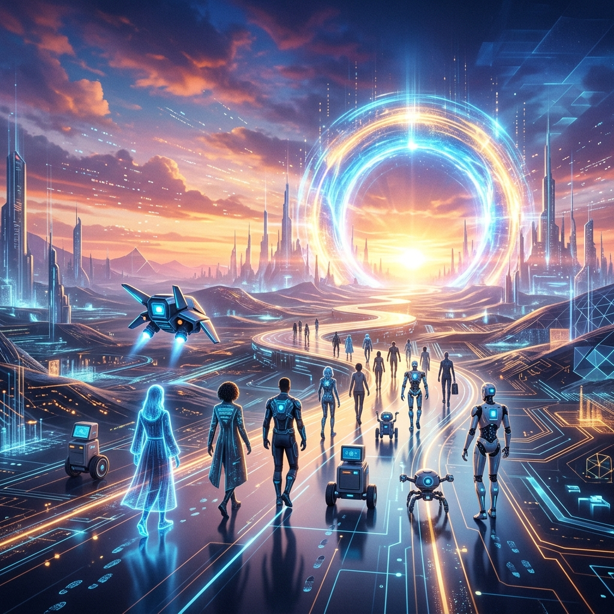

This is the **final installment of the 78-post technical blog pipeline** on 0xhenry.dev.

---

Starting from embedded hardware to cloud security, MCP protocols, RAG deep dives, and the latest reasoning models... we’ve run at a breakneck pace. Now, I want to forecast the **AI ecosystem of 2027,** the point where all these technologies converge.

---

### 1. From Tools to Autonomy

Today's agents are more like 'tools' that help us with the tasks we assign. But in 2027, **'Autonomous Agents'** that take a goal and autonomously set plans, execute budgets, and report results will be the standard. The MCP and security architectures we learned will be the safety nets for this autonomy.

---

### 2. Edge-Cloud Hybrid Intelligence

We won't leave everything to the cloud. A hybrid approach—where sensitive data is processed on the local Edge (Edge AI) and complex reasoning is passed to massive models (Cloud AI)—will become universal. This is why the technologies we covered in Chapter E will be your most powerful weapons.

---

### 3. The Disappearance of Interfaces: Invisible Intelligence

Moving beyond typing prompts into a search bar. **'Ambient Intelligence'**—where AI agents embedded in objects, browsers, and smartphones anticipate and execute our intentions—is coming.

---

### Closing the 78-Post Series: "The Protagonist is You"

Technology is just a tool. What matters is the **'human will'** to determine what value to create and what problems to solve with those tools.

I hope the records of these past 78 posts have served as a small but solid map as you explore the vast new continent of AI agents. I’ve drawn the map, but walking the path and creating the voyage is solely your responsibility.

I’m stopping here for a moment, but Henry and your agents are likely evolving this very second.

**Series Complete. Would you like to begin your voyage?**

---

**0xhenry.dev Technical Blog Pipeline (April 2026) — [COMPLETE]**
(8 Chapters, 78 High-Quality Posts Finished - C/A/S/O/R/E/P/M)
