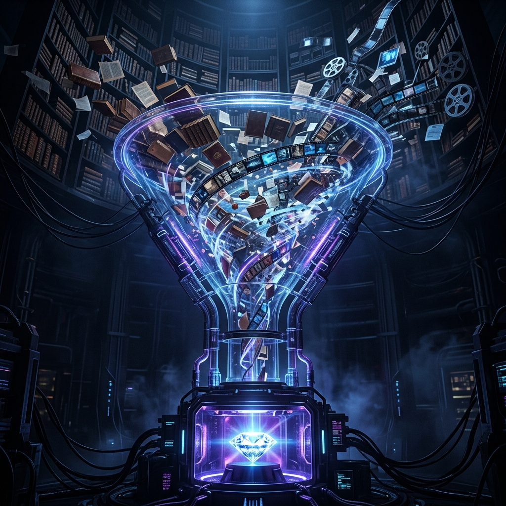

이 글은 **최신 모델 시리즈** 3편입니다.

→ 2편: [Llama-3.1의 충격: 오픈 소스가 클로즈드 모델을 따라잡은 순간](/ko/study/M_models/llama31-impact)

---

구글의 **Gemini 1.5 Pro**는 다른 어떤 모델도 따라오지 못한 필살기가 있습니다. 바로 **100만 토큰(Optional 2M)**에 달하는 광활한 컨텍스트 윈도우입니다. 

단순히 "많이 읽는다"를 넘어, 이것이 에이전트의 작업 방식을 어떻게 근본적으로 바꾸는지 3가지 사례로 살펴봅니다.

---

### 1. 코드베이스 전체 주입 (Codebase Zero)

기존에는 코드의 일부분만 검색해서 모델에게 줬습니다. 하지만 Gemini 1.5 Pro는 **수만 줄의 프로젝트 전체**를 한 번에 읽습니다. 
- **장점**: 함수 간의 복잡한 의존성이나 전체 아키텍처를 완벽히 이해한 상태에서 버그를 찾고 기능을 개발합니다. RAG 단계에서 발생하는 정보의 누락이 없습니다.

---

### 2. 비디오 semantic 검색

1시간짜리 영상을 Gemini에게 주면, 모델은 영상 속 특정 시점의 대화나 시각적 사건을 정확히 짚어냅니다. 
- **사례**: "아까 흰 옷 입은 사람이 가방을 내려놓은 시간이 언제야?"라는 질문에 즉시 답할 수 있습니다. 영상 처리 에이전트에게는 혁명적인 도구입니다.

---

### 3. 'Needle In A Haystack'의 완벽성

아무리 길게 읽어도 중간에 있는 정보를 까먹으면 소용없습니다. Gemini는 100만 토큰 깊숙이 숨겨진 작은 정보 하나를 찾아내는 테스트에서 **99% 이상의 성공률**을 보여줍니다. 이는 거대한 법률 문서나 기술 매뉴얼을 다루는 에이전트에게 최고의 안정성을 보장합니다.

---

### Henry의 실무 팁: "Context Caching을 활용하라"

100만 토큰을 매번 보내면 비용과 시간이 많이 듭니다. 구글이 제공하는 **Context Caching** 기능을 쓰세요. 한 번 올려둔 거대한 데이터는 캐싱되어, 다음 질문부터는 훨씬 저렴하고 빠르게 답변을 받을 수 있습니다.

---

**다음 글:** [Groq: LPUs가 바꾼 LLM 추론 속도의 혁명](/ko/study/M_models/groq-speed-revolution)
