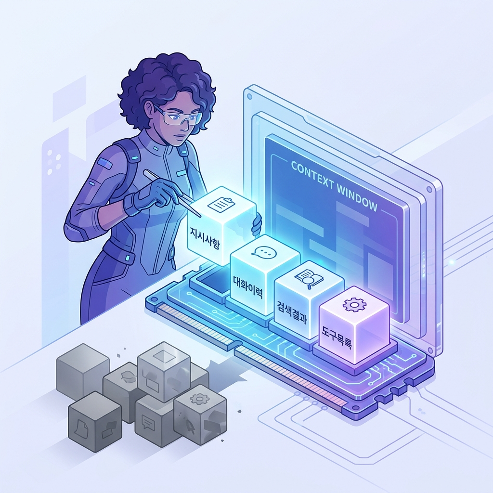
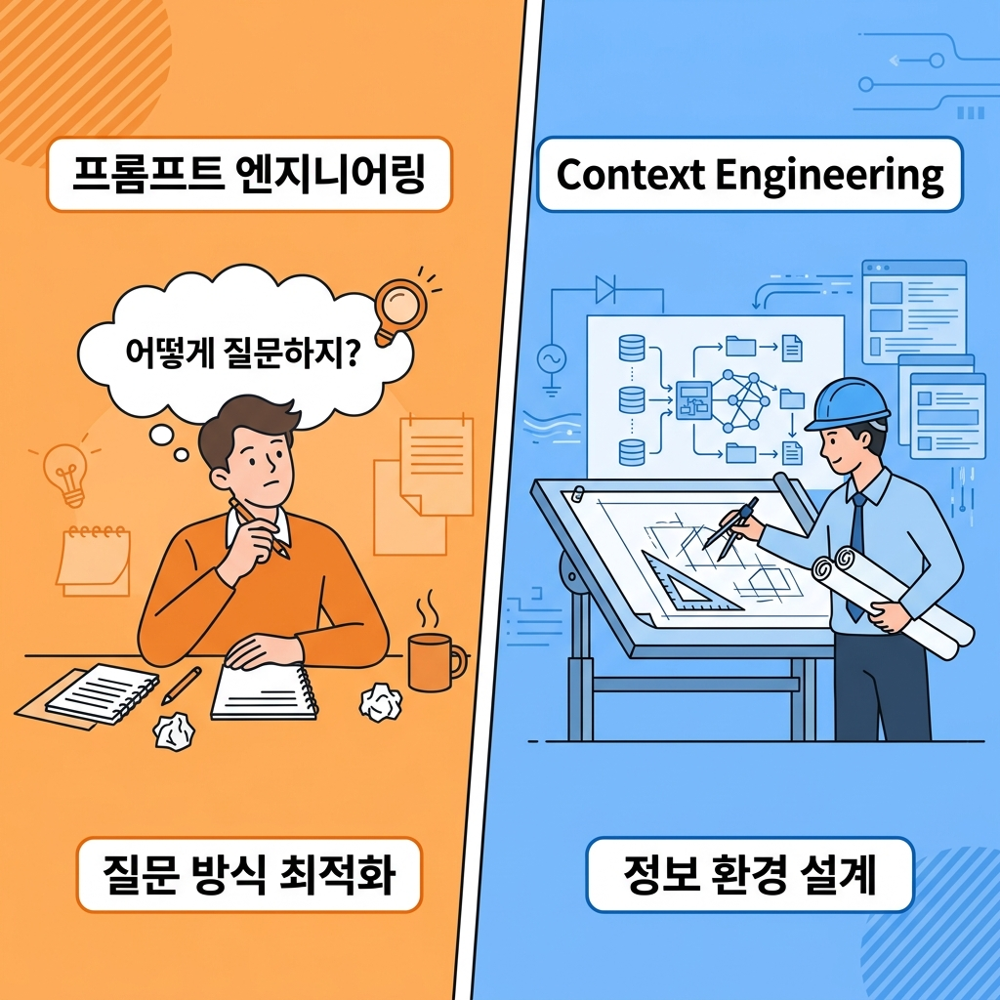
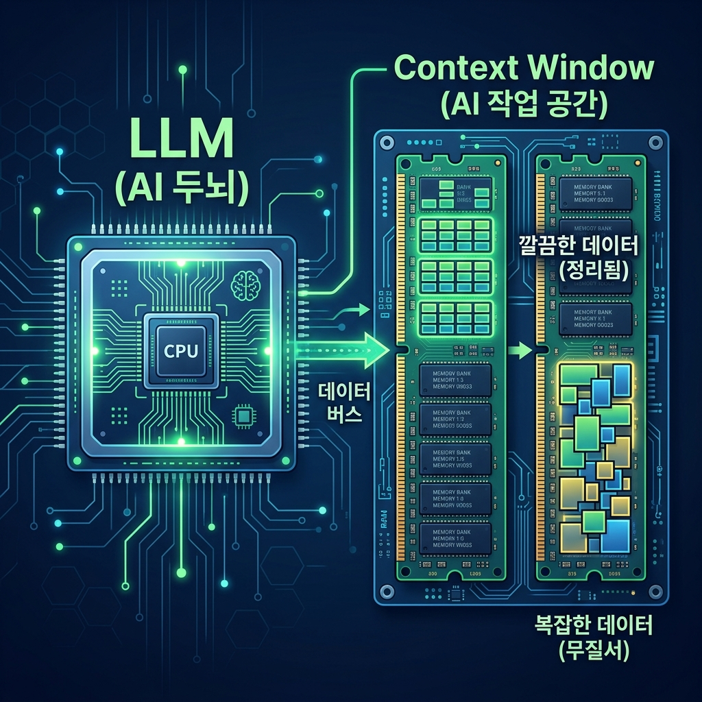

프롬프트 엔지니어링은 구식? 2026년 AI의 새 패러다임 정리

요즘 해외 AI 개발자 커뮤니티에서 이런 말이 돌고 있어요. "프롬프트 엔지니어링을 잘하는 것만으론 부족하다." 그럼 이제 뭘 잘해야 할까요?

2026년, AI 엔지니어링에서 가장 뜨거운 새 키워드가 등장했습니다. 바로 **Context Engineering(컨텍스트 엔지니어링)**이에요.

솔직히 처음 이 말 들었을 때 저도 "또 새 유행어야?" 했는데, 알고 보니 핵심이 있더라고요.

## 프롬프트 엔지니어링, 한계가 있었다?

프롬프트 엔지니어링은 AI에게 **"어떻게 질문하냐"**를 연구하는 기술이에요. 더 정확한 질문, 더 구조화된 지시문을 쓰면 더 좋은 답이 나온다는 거죠.

그런데 실제로 AI를 오래 써본 분들이라면 이런 경험 있지 않으세요? 대화가 길어지면 길어질수록 AI가 점점 이상한 답을 내놓기 시작하는 거요. 앞에서 한 말을 무시하거나, 엉뚱한 소리를 한다거나...

그게 바로 **컨텍스트 문제**예요. 질문 방식의 문제가 아니라, AI가 보고 있는 "정보 창고"가 지저분해진 거거든요.

## Context Engineering이 뭔데?

이걸 이해하는 가장 쉬운 비유가 있어요.

**AI가 CPU라면, 컨텍스트 창(Context Window)은 RAM**이에요.

컴퓨터가 작업할 때 RAM에 필요한 데이터를 올려두잖아요. RAM이 너무 많은 쓰레기 데이터로 가득 차면 속도가 느려지고 오류가 나죠.

AI도 마찬가지예요. 대화 이력, 검색 결과, AI에게 내린 지시가 뒤섞여서 컨텍스트 창에 잔뜩 쌓이면, AI가 제대로 된 판단을 못 해요.

Context Engineering은 바로 이 **"RAM 관리"**예요. AI에게 보여줄 정보를 얼마나 깔끔하고 정확하게 구성하느냐가 핵심이에요.

- ❌ 프롬프트 엔지니어링: "AI에게 어떻게 말하지?"
- ✅ Context Engineering: "AI가 무엇을 보고 있도록 설계하지?"

개발자들 사이에서는 "이제 대형 언어 모델을 얼마나 잘 다루느냐보다, 그 모델이 보는 '정보 환경'을 얼마나 잘 설계하느냐가 더 중요해졌다"라고 말해요.

## 왜 지금 이게 중요한가요?

실제로 AI 서비스를 만들어보면 이런 일이 생겨요. 처음엔 AI가 잘 답하다가, 어느 순간부터 대화가 이상해져요. Anthropic(Claude 만든 회사)의 연구에 따르면, 컨텍스트가 너무 많아지면 AI가 맨 앞과 맨 뒤 내용만 집중하고 중간은 무시하는 경향이 있다고 해요.

이걸 "Lost in the Middle" 문제라고 부르는데, 컨텍스트 창이 100만 토큰으로 늘어나도 이 문제는 사라지지 않아요. 오히려 더 심해질 수 있고요.

결론적으로, 2026년 AI 개발의 핵심은 **더 좋은 질문을 쓰는 것**보다 **AI가 보는 정보를 더 잘 선별하고 구조화하는 것**으로 이동했어요.

비개발자 분들도 이 개념을 알아두면 좋은 이유가 있어요. AI 챗봇이랑 대화할 때도 불필요한 얘기를 길게 늘어놓기보다, 지금 이 질문에 필요한 정보만 딱 정리해서 주는 습관이 훨씬 좋은 답을 받는 비결이거든요.

여러분은 AI를 쓸 때 맥락을 어떻게 정리하고 있으신가요? 댓글로 나눠주세요!

#컨텍스트엔지니어링 #프롬프트엔지니어링 #AI트렌드 #LLM #AI용어 #인공지능 #AI개발 #ChatGPT활용
