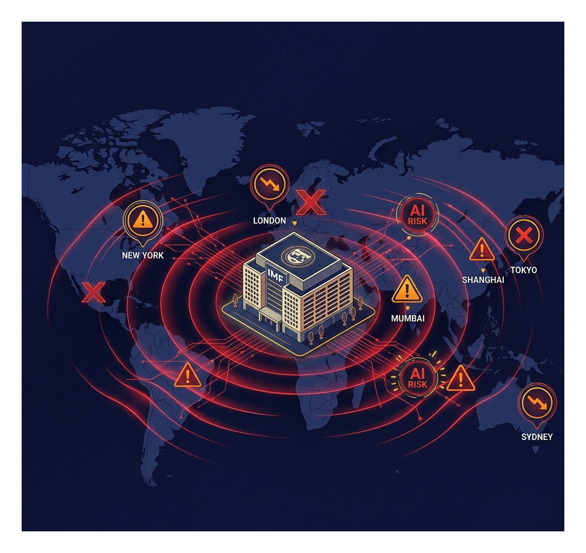

# IMF가 AI 때문에 "금융 시스템이 위험하다"고 경고했습니다 — 오늘 오전 터진 뉴스

*2026년 4월 13일*

---

오늘 아침에 꽤 충격적인 발표가 나왔어요.

IMF, 그러니까 국제통화기금의 수장인 크리스탈리나 게오르기에바 총재가 공개적으로 이렇게 말했습니다:

*"현재 글로벌 금융 시스템은 고도화된 AI가 초래하는 사이버 보안 위협에 대처할 준비가 되어 있지 않다."*

경제·금융 기관 중 이 정도 수위의 AI 경고를 공개적으로 한 곳은 처음 수준이에요.

왜 이게 나왔는지, 그리고 우리한테 뭘 의미하는지 정리해봅니다.

---

## 배경: Anthropic Mythos 사태가 계속 파장 중

이 경고는 갑자기 나온 게 아닙니다.

지난주 Anthropic이 발표한 Mythos 모델 — 스스로 시스템 취약점을 찾아내고 침투하는 수준의 AI — 이 공개된 이후, 미국 재무부 장관 스콧 베센트와 연방준비제도 의장 제롬 파월이 주요 은행 경영진들과 비공개 긴급 회의를 가진 것으로 알려졌어요.

이 회의의 주제가 바로 "AI가 금융 시스템에 가할 수 있는 사이버 위협"이었습니다.

IMF 총재의 오늘 발언은 그 이후에 나온 거예요. 즉, 단순한 기술 뉴스가 아니라 **글로벌 금융 안전성과 연결된 이슈**로 격상된 거죠.

---

## 은행과 금융 시스템이 왜 위험한가요

AI의 해킹 능력이 고도화되면, 가장 먼저 타깃이 되는 건 의외로 방어가 취약한 중소 금융 기관들입니다.

대형 은행들은 보안 팀도 크고, 업데이트도 빠르지만 — 지방 은행, 핀테크 스타트업, 신용협동조합 같은 곳들은 그렇지 않아요. 그리고 이 기관들이 연결된 결제 네트워크가 무너지면, 연쇄 효과가 생깁니다.

IMF가 특히 우려하는 건 "자동화된 공격 스케일"이에요. 기존엔 해커 한 명이 한 번에 한 곳을 공략했다면, AI는 동시에 수백 개의 시스템을 스캔하고 취약점을 찾아낼 수 있거든요.

---

## 한국 금융권은 어떤가요

솔직히 한국 금융권도 안전하지 않습니다.

2023년에 카카오 데이터센터 화재로 카카오페이, 카카오뱅크 등 서비스가 몇 시간씩 마비된 사태를 기억하시는 분 많으실 거예요. 그게 물리적 장애였다면, AI 사이버 공격은 더 정교하고 더 빠르게 파고들 수 있습니다.

금융위원회가 AI 보안 가이드라인을 최근 강화하고 있는 이유가 여기 있어요. 하지만 규제가 기술 발전 속도를 따라가는 건... 솔직히 쉽지 않은 상황이에요.

---

## 그럼 개인은 어떻게 해야 하나요

거시적인 얘기를 개인 수준으로 가져오면 이렇습니다.

- **OTP, 2차 인증은 반드시 켜두세요.** AI가 아무리 정교해도, 2차 인증이 있으면 공략 난이도가 확 올라갑니다.
- **같은 비밀번호 여러 곳에 쓰지 마세요.** 한 곳이 뚫리면 AI가 나머지를 자동으로 시도합니다. (크리덴셜 스터핑이라고 해요)
- **금융 앱 알림 설정 확인.** 낯선 로그인, 작은 금액 자동이체 등 이상 징후를 실시간으로 받는 설정을 미리 켜두는 게 좋습니다.

---

## 흥미로운 역설: AI로 AI를 막는다

역설적이지만, 이 위협에 대응하는 것도 결국 AI예요.

Anthropic의 Project Glasswing처럼, 금융권에서도 AI를 이용해 스스로 취약점을 먼저 찾아내는 방어적 활용이 빠르게 확산되고 있습니다. 공격용 AI와 방어용 AI의 군비 경쟁이 이미 시작된 거죠.

---

IMF까지 나서서 경고를 하는 수준이니, 이게 괜한 걱정이 아닌 건 분명합니다. 앞으로 금융 보안과 AI의 교차점이 계속 뜨거운 이슈가 될 것 같아요.

이 내용에 대해 더 알고 싶은 부분 있으시면 댓글 달아주세요.

### 💰 0xHenry의 한 줄 평: "중앙화된 시스템은 AI의 가장 쉬운 먹잇감입니다"

IMF의 경고는 금융의 '중앙화'가 AI 공격에 얼마나 취약한지 보여줍니다. 앞으로는 금융 거래에서도 **'개인화된 보안 장벽'**이 중요해질 거예요. 2차 인증을 넘어, 나만의 로컬 환경에서 검증된 거래만 승인하는 방식의 개인 금융 인프라 구축을 고민해야 할 때입니다.

---

**태그:** #IMF경고 #AI금융보안 #AI사이버공격 #AntropicMythos #금융보안 #인공지능위험 #사이버보안 #AI뉴스 #글로벌AI
