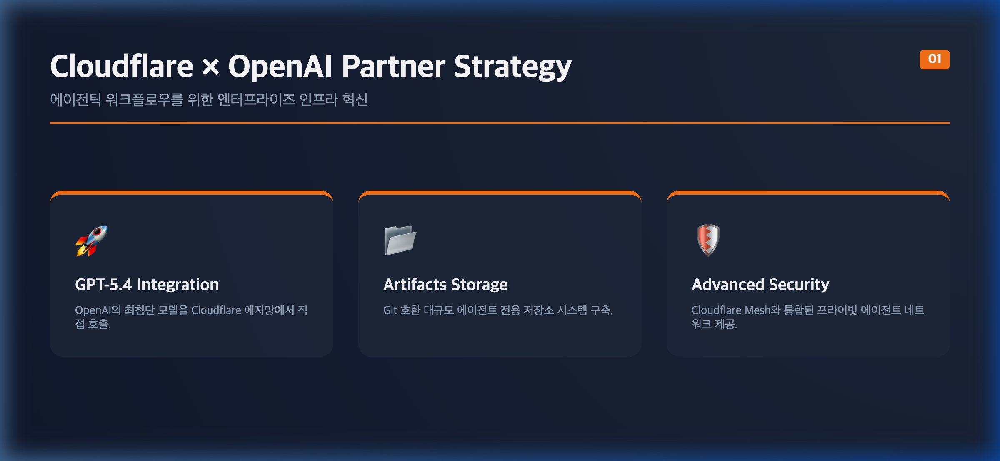
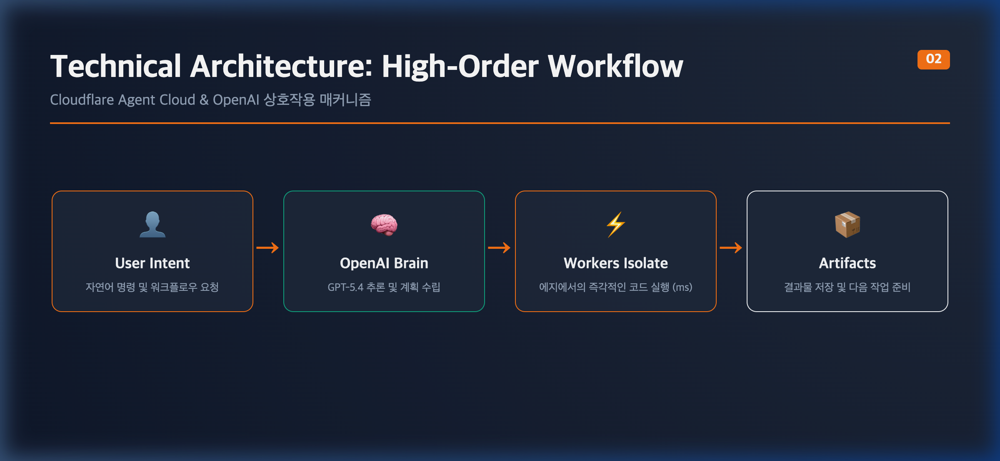
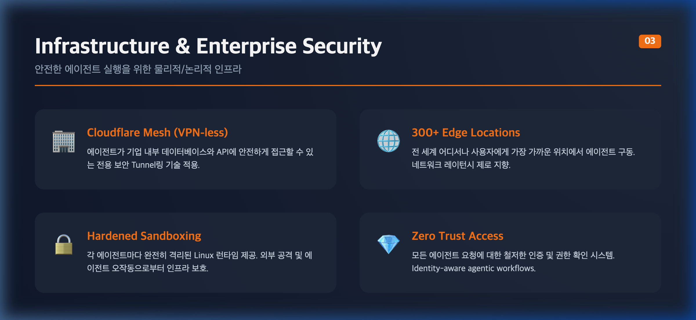

안녕하세요, 0xHenry입니다.

최근 **Cloudflare와 OpenAI의 대규모 파트너십 업데이트**는 단순히 모델을 API로 연결하는 수준을 넘어, 전 세계 엣지 네트워크상에 '자율형 에이전트'를 심기 위한 거대한 인프라 통합으로 요약할 수 있습니다. 

이번 변화가 엔터프라이즈 환경에 어떤 파급력을 가져올지, 핵심 슬라이드 자료 3장을 통해 심층 분석해 보겠습니다.

---

### 슬라이드 1. 전략 요약 (Strategic Summary)

이번 파트너십의 핵심 가치는 **'실행력'**입니다. 단순히 똑똑한 챗봇을 만드는 것이 아니라, 직접 코드를 배포하고 데이터를 관리하는 에이전틱 워크플로우를 타겟으로 합니다.

*(그림 1. 파트너십 핵심 전략 및 가치 제안)*

- **GPT-5.4 & Codex 네이티브 통합**: OpenAI의 최신 모델을 클라우드플레어 인프라에 직접 탑재하여 지연 시간을 극소화했습니다.
- **Artifacts 전용 저장소**: Git과 호환되는 텐밀리언(10M) 규모의 에이전트 전용 저장 시스템을 구축했습니다.

---

### 슬라이드 2. 기술 아키텍처 (Technical Architecture)

사용자의 의도가 어떻게 실제 인프라의 동작으로 바뀌는지 보여주는 고차원 워크플로우입니다.

*(그림 2. 에이전틱 워크플로우 상호작용 매커니즘)*

사용자 요청이 들어오면 **OpenAI Brain**이 계획을 수립하고, 클라우드플레어의 **Workers Isolate**가 밀리초(ms) 단위의 빠른 부팅 속도로 즉시 코드를 실행합니다. 결과물은 **Artifacts** 시스템에 실시간으로 반영되어 다음 에이전트 작업의 토대가 됩니다.

---

### 슬라이드 3. 인프라 및 보안 (Infrastructure & Security)

에이전트에게 내부 데이터 접근 권한을 주는 것은 매우 위험한 작업입니다. 이를 해결하기 위한 물리적/논리적 보안 인프라가 이번 업데이트의 숨은 주역입니다.

*(그림 3. 안전한 에이전트 실행을 위한 엔터프라이즈 보안 레이어)*

- **Cloudflare Mesh**: 에이전트가 VPN 없이도 기업 내부 DB와 안전하게 연결되는 전용 보안 터널링을 제공합니다.
- **Hardened Sandboxing**: 모든 에이전트 작업은 완전히 격리된 Linux 런타임에서 실행되어 메인 인프라의 오염을 방지합니다.

---

### 💡 0xHenry's Insight
이번 협력은 "AI가 무엇을 아는가"에서 **"AI가 무엇을 할 수 있는가"**로 인프라의 무게중심을 옮겼습니다. 300개가 넘는 글로벌 에지 포인트에서 동시다발적으로 생각하고 행동하는 AI 에이전트의 물결이 이제 곧 엔터프라이즈 현장에 들이닥칠 것입니다.

전략 슬라이드를 통해 살펴본 것처럼, 이제 개발자들은 인프라 고민 없이 OpenAI의 지능과 Cloudflare의 실행력을 결합한 강력한 비즈니스 에이전트를 구축할 수 있게 되었습니다.

여러분의 비즈니스에는 어떤 에이전틱 워크플로우가 가장 먼저 필요하신가요? 댓글로 의견을 들려주세요!

---

#Cloudflare #OpenAI #AgenticWorkflow #GPT5 #에이전트 #클라우드컴퓨팅 #IT인프라 #기술블로그 #0xHenry
