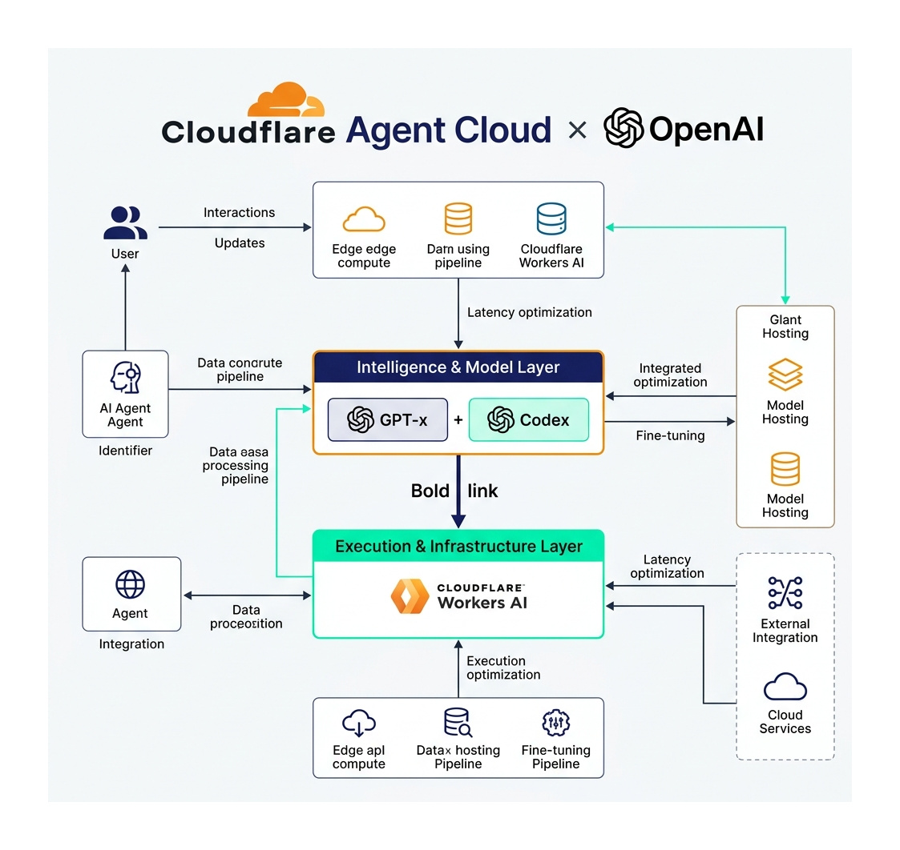
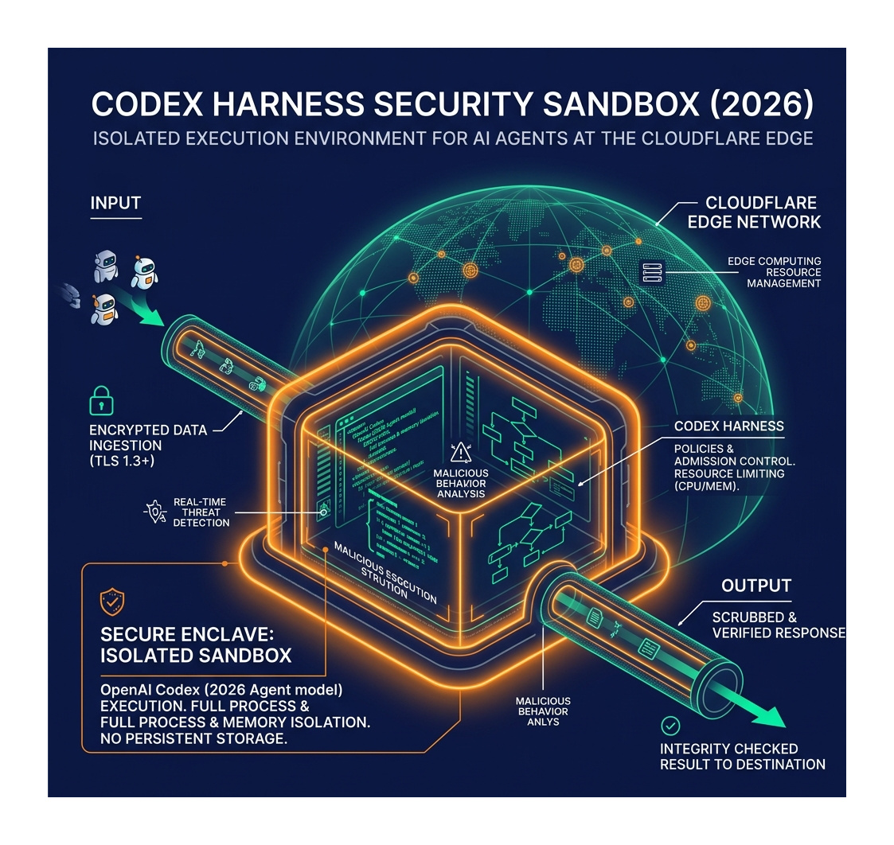
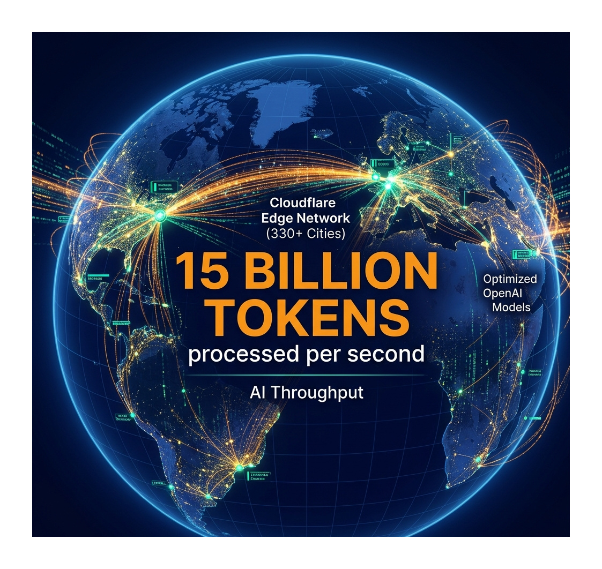

안녕하세요, 0xHenry입니다.

최근 **Cloudflare와 OpenAI의 대규모 파트너십 업데이트**는 단순히 모델을 API로 연결하는 수준을 넘어, 전 세계 엣지 네트워크상에 '자율형 에이전트'를 심기 위한 거대한 인프라 통합으로 요약할 수 있습니다. 

이번 변화가 엔터프라이즈 환경에 어떤 파급력을 가져올지, 고해상도 기술 리포트 사진 3장을 통해 심층 분석해 보겠습니다.

---

### 1. 지능과 인프라의 결합: AI 에이전트 아키텍처

이번 파트너십의 핵심 가치는 **'실행력'**입니다. 단순히 똑똑한 챗봇을 만드는 것이 아니라, 직접 코드를 배포하고 데이터를 관리하는 에이전틱 워크플로우를 타겟으로 합니다.

*(사진 1. OpenAI의 지능과 Cloudflare의 실행력이 만난 차세대 에이전트 아키텍처)*

- **GPT-5.4 & Codex 네이티브 통합**: OpenAI의 최신 모델을 클라우드플레어 인프라에 직접 탑재하여 지연 시간을 극소화했습니다.
- **Intelligence & Model Layer**: 에이전트의 사고와 계획 수립이 엣지 레벨에서 즉각적으로 이루어집니다.

---

### 2. 보안의 대전환: Codex Harness Sandbox

에이전트에게 권한을 주는 것은 매우 위험한 작업입니다. 이를 해결하기 위한 'Codex Harness' 보안 인프라가 이번 업데이트의 숨은 주역입니다.

*(사진 2. 안전한 에이전트 실행을 위한 격리된 샌드박스 및 보안 엔클레이브)*

- **Isolated Execution**: 모든 에이전트의 코드 실행은 완전히 격리된 환경에서 이루어져 메인 인프라 오염을 차단합니다.
- **Malicious Behavior Analysis**: 실시간으로 에이전트의 비정상적인 행동을 감지하고 차단하는 실시간 위협 탐지 레이어가 포함되었습니다.

---

### 3. 글로벌 스케일의 성능: 초당 150억 토큰 처리

전 세계 330개 이상의 도시에서 동시다발적으로 구동되는 에이전트 시스템은 그 자체로 거대한 지능형 네트워크가 됩니다.

*(사진 3. 330개 이상의 글로벌 엣지 포인트에서 구현되는 초당 150억 토큰 이상의 압도적인 AI 처리 성능)*

- **Cloudflare Workers AI**: 전 세계 어디에서나 5ms 미만의 지연 시간으로 에이전트를 호출할 수 있는 분산 네트워크를 제공합니다.
- **AI Throughput Optimization**: 대규모 기술 워크플로우를 처리하기 위한 고대역폭 AI 파이프라인이 최적화되었습니다.

---

### 💡 0xHenry's Insight

이번 협력은 "AI가 무엇을 아는가"에서 **"AI가 무엇을 할 수 있는가"**로 인프라의 무게중심을 옮겼습니다. 

전략 리포트를 통해 살펴본 것처럼, 이제 개발자들은 인프라 보안이나 지연 시간 고민 없이 OpenAI의 지능과 Cloudflare의 실행력을 결합한 강력한 '에이전틱 엔터프라이즈'를 구축할 수 있게 되었습니다.

여러분의 비즈니스에는 어떤 에이전틱 워크플로우가 가장 먼저 필요하신가요? 댓글로 의견을 들려주세요!

---

#Cloudflare #OpenAI #AgenticWorkflow #GPT5 #에이전트 #클라우드컴퓨팅 #IT인프라 #기술블로그 #0xHenry
